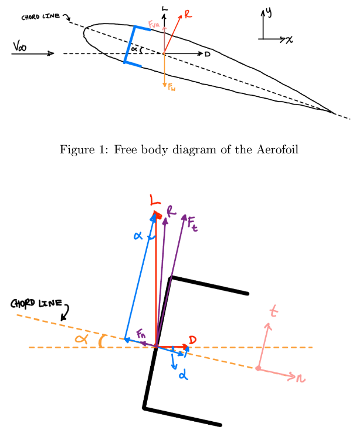
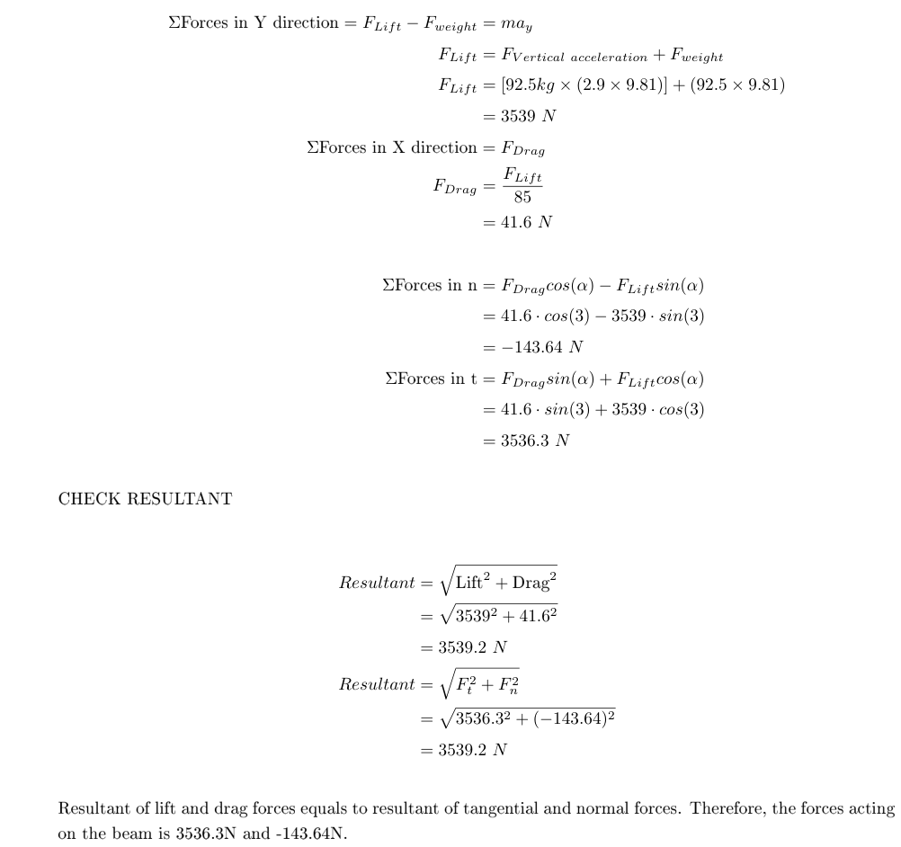
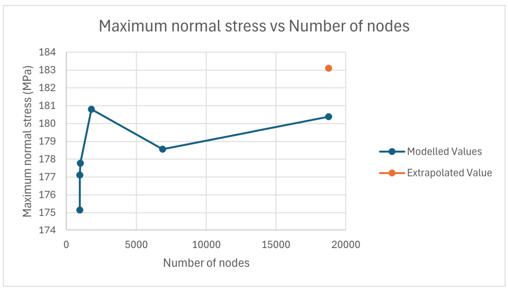
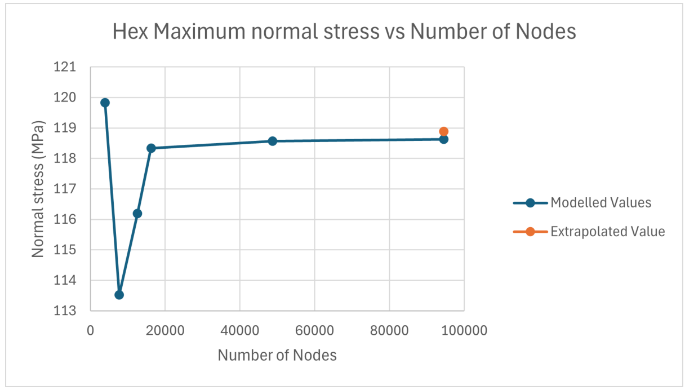
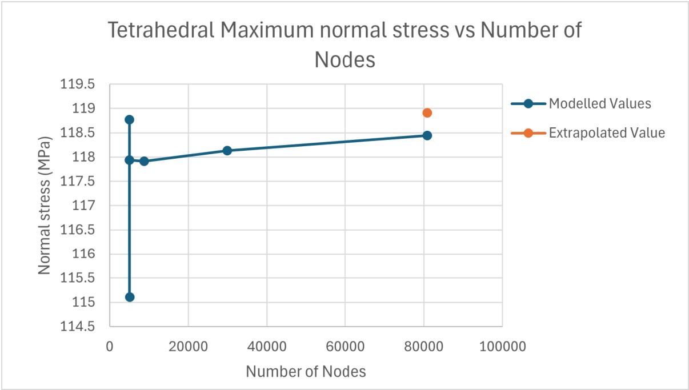
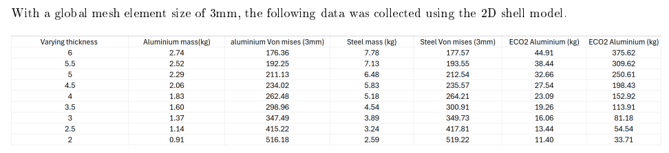

# Analysis of a C channel

## Overview 
This was the first time I had to use ANSYS FEA alongside analytical validation for mechanics of materials. The assignment background was that a C beam was being used as support across a UAV wing. I had to analyse my specific C beam dimensions to determine if my sizing was suitable for the wing and the expected loads, and to consider 2 different material options as well. The full report can be found in the files. 

## Objectives 
- Conduct finite element analysis on the C beam with my dimensions.
- Validate those results analytically.
- Compare the results of the beam with aluminium alloy, and steel.
- Report back the findings.

## Tools and concepts used
- Analysis of a C beam using engineering beam theory.
- ANSYS FEA for 2 materials
- Inventor for modelling
- Mesh convergence

## Methodology
- Firstly, the beam had to be modelled in Inventor with my particular measurements. After modelling the beam correctly, it was exported as a STEP file into ANSYS.
- After that, I proceeded with hand calculations to evaluate the reaction forces acting on the beam. After calculating the forces acting on the middle and the end of the beam, I could add them into the FEA model as remote loads.
- The beam was fixed on one end. The beam also had to undergo a shell analysis and 3D model analysiss for both materials. The shell model was made in SPaceClaim and used for simplifying the model results. The 3D model analysis was used for a more in depth result.
- The FEA set up used a fixed boundary support on the larger end of the beam, and 2 remote loads with the appropriate component forces located at the middle and the end of the beam.
- The analysis was done 25mm away from the fixed boundary support to reduce the modelling of stress singularities. I used a path along the web of the C channel for obtaining my results. In hindsight, I should have used a path along the full C channel, to get a more accurate result.
- The output obtained from the model was maximum Von Mises stress, maximum normal stress, maximum shear stress, total deformation and total elastic energy. A tetrahedral mesh and hex mesh was used for each output result in the mesh convergence study to compare which mesh method was the most accurate. A Richardson Extrapolation was used for approximation of the true solution.

## Results
- Full shell models and 3D models of the beam was analysed in ANSYS and a mesh convergence study was conducted. The results of the mesh convergence showed some stress singlarities and uneven results in the graphs. However, most of the results still converged as the number of mesh nodes increased.
- Unfortunately, the method I used to calculate the normal stresses were wrong, and I managed to understand how and where I went wrong.
- The final results of the mesh convergence and FEA was that the C beam with my dimensions was a good choice to use as a structural support for the UAV wing.
- Although the steel beam would have been a stronger support for the wing, the steel C beam with the smallest thickness of 2mm was much heavier than a 5mm thick aluminium C beam. The Aluminium beam could be optimised to have a thickness of 3mm, while having a 1.5 safety factor, and weigh 1.4kg.
- Thus, from FEA, and some hand calculations, the best material to use for the support beam was the aluminium alloy. 
  
## Project images

  

  <i>Figure 1: Free body Diagram of the wing cross section and C beam </i>

  

  <i>Figure 2: Reaction force calculations </i>

  

  <i>Figure 3: FEA force setup </i>

  

  <i>Figure 4: FEA support setup </i>

  

  <i>Figure 5: Shell normal stress convergence study </i>

 

 
  

  <i>Figure 6: Solid model normal stress convergence study using hexagonal sizing</i>

  

  <i>Figure 7: Solid model normal stress convergence study using tetrahedral sizing</i>

  

  <i>Figure 8: Embodied carbon of aluminium and steel (last column is steel not aluminium) </i>

The full report with complete calculations and discussion can be found in the files. Note that the hand caculations are not completely accurate and could be more rigorous. 

## What I learnt
- How to use FEA to analyse objects.
- How to use SpaceClaim to obtain a shell model.
- How a mesh convergence study can be used to check the validity of results.
- I also leant to have complete, rigorous workings in my report as that did cost me alot of marks.
- I learnt that my initial calculations for the normal stresses were wrong, and slowly understood the correct way to complete the hand calculations.
- I learnt that the Richardson extrapolation had to be shown across an infinite range of node sizes, and not just as a singular point.
- I understood the meaning of embodied carbon and how it can affect the consideration of materials for manufacturing and its lifetime usage.

<!-- 

  

  <i>Figure 1: </i>

 --!>
